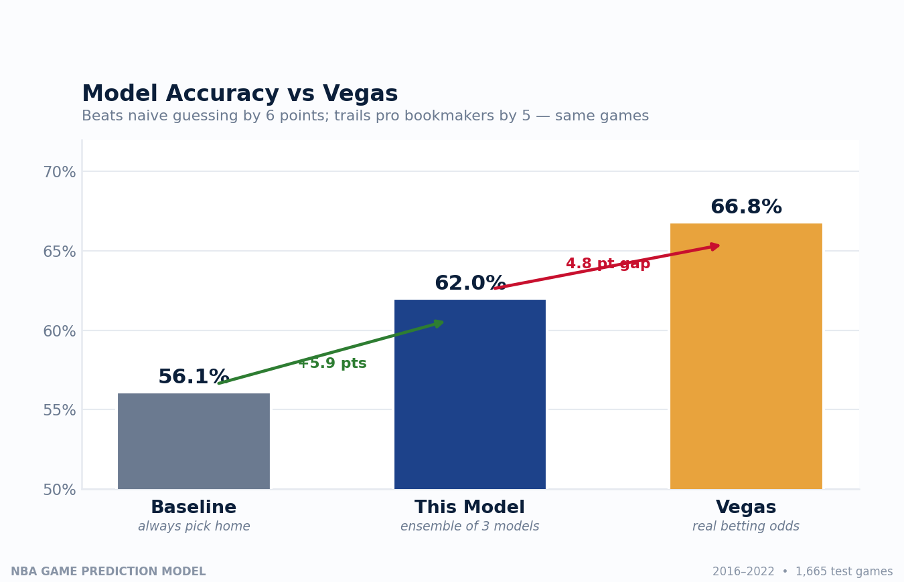
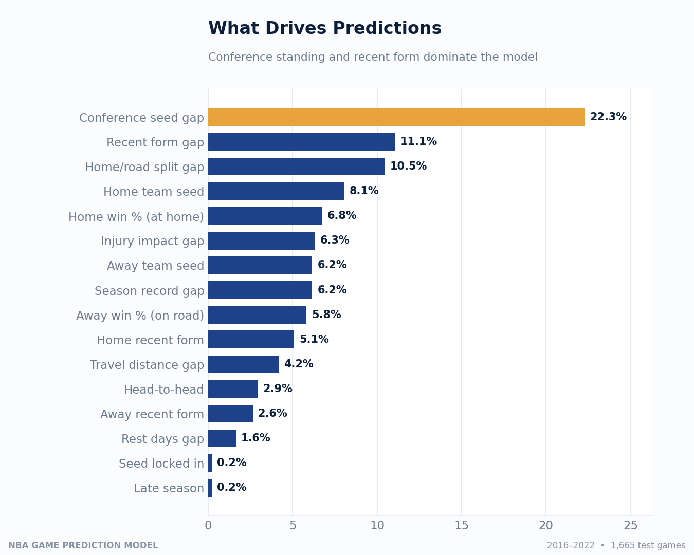
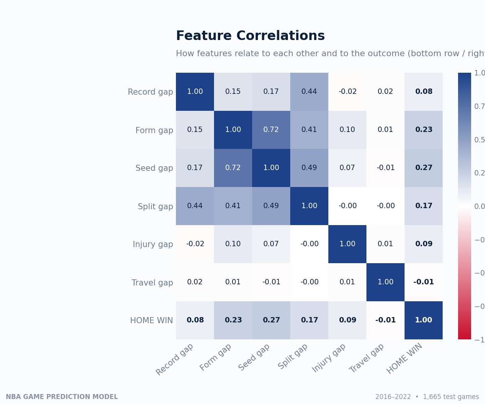
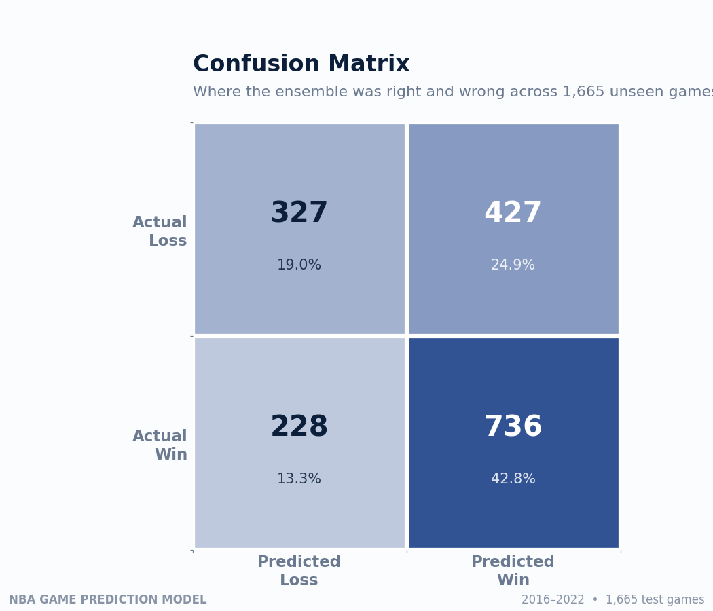

# 🏀 NBA Game Outcome Prediction: A Machine Learning Project

Predicting whether the **home team wins** an NBA game using only information available **before tip-off**. No data leakage.

Built with Python, Pandas, and Scikit-Learn across ~8,600 NBA games (2016 to 2022).

---

## 📊 Results

| Model | Accuracy |
|-------|----------|
| Baseline (always pick home team) | 56.1% |
| Logistic Regression | 61.9% |
| Random Forest | 61.5% |
| Gradient Boosting | 61.9% |
| **Ensemble (all three)** | **62.0%** |

The model beats the home-court baseline by **~6 percentage points**, evaluated on a held-out set of the **1,718 most recent games** the model never saw during training.

### Benchmarked against real Vegas odds

On the **same 1,665 test games** (matched to historical betting data), the comparison is:

| Predictor | Accuracy |
|-----------|----------|
| Baseline (always pick home) | 56.1% |
| **This model** | **62.0%** |
| Vegas (actual betting favorites) | 66.8% |

The model closes most of the distance between naive guessing and professional bookmakers. The remaining **~5-point gap to Vegas** is a real, measured quantity. It represents the value of the data Vegas has that public box scores don't: live injury severity, betting-market movement, and play-by-play lineup data.
*(Vegas accuracy computed directly from historical moneyline favorites, not assumed. Consistent with published research placing sharp NBA models near 67 to 70%.)*



---

## 🧠 Key Idea: No Data Leakage

The hardest and most important part of this project. A game's final box-score stats (points, shooting %) reveal the outcome, so using them would be cheating. **Every feature is computed from each team's history *coming into* the game**, never from the game itself.

The discipline, applied in every feature loop: **record the feature first, then update history with the result.** Models are also evaluated on a **time-based split** (train on older games, test on newer ones) rather than a random split, because predicting the past from the future is itself a form of leakage.

---

## 🔧 Features Engineered (16 total, all leakage-free)

| Feature | What it captures |
|---------|------------------|
| `winpct_diff` | Season win-% gap between the teams |
| `form_diff`, `home_form10`, `away_form10` | **Recent form** (last-10-game win %), the strongest behavioral signal |
| `seed_diff`, `home_seed`, `away_seed` | **Conference standings** before the game, the single most important predictor |
| `split_diff`, `home_home_winpct`, `away_road_winpct` | **Home/road splits**. Some teams travel far better than others. |
| `injury_diff` | **Star-weighted injuries**: players out × their scoring average, not just a headcount |
| `travel_diff` | Miles flown from each team's previous game (haversine distance) |
| `rest_diff` | Days of rest and back-to-back fatigue |
| `h2h_home_winrate` | Recent head-to-head record in this matchup |
| `late_season`, `home_locked_in` | Late-season "coasting" proxy (see findings) |



---

## 🔍 What the Model Learned

* **Conference seed difference** and **recent form** dominate. *How good a team is right now*, relative to its conference, matters more than raw season record.
* **Home/road splits** are a strong, often-overlooked signal.
* **Star-weighted injuries** contribute real (if smaller) signal. Weighting by player scoring was worth the extra data engineering versus a naive injury count.
* A simple **late-season "locked-in seed" flag added little**, but building it produced the conference-standings features that turned out to be the model's strongest predictors.




---

## 🎯 The Honest Ceiling

Three different algorithms and an ensemble all plateau near **62%**. When multiple model families converge on the same number and combining them doesn't help, the limiting factor is the **information in the data**, not the model.

Professional bookmakers reach ~70%, but using data **not present in box scores**: live injury severity and game-time decisions, betting-market movement, referee assignments, and play-by-play lineup data. Reaching their accuracy is a *data-access* problem, not a modeling one. A deliberate finding of this project, confirmed experimentally rather than assumed.

---

## 🚀 Future Work

* **Betting-market features** (opening/closing spreads). Largest accuracy gain, at the cost of interpretability (arguably circular for a "prediction" model).
* **Play-by-play / lineup data**. True on-court impact, significant engineering effort.
* **Full standings-based motivation modeling**. Proper "can this team still move seeds?" logic.
* **Player-level matchup features**. Positional advantages not captured by team aggregates.

---

## 🗂️ Repository Structure
NBA_Prediction.ipynb        # Full annotated pipeline (start here)
build_features.py           # Reproducible feature-engineering script
README.md
images/                     # All generated charts

## ⚙️ How to Run

```bash
pip install pandas numpy scikit-learn matplotlib seaborn
jupyter notebook NBA_Prediction.ipynb
```

## 📚 Data Sources

* NBA games & box scores (Kaggle, Nathan Lauga "NBA games" dataset)
* NBA injury logs (Kaggle, 2016 to 2025 injury data)
* Team metadata for city/travel calculations

---

*Built as a data-science portfolio project. The emphasis is methodological rigor: leakage-free features, honest time-based evaluation, and a clear-eyed read of what the data can and cannot predict, over chasing an inflated accuracy number.*
